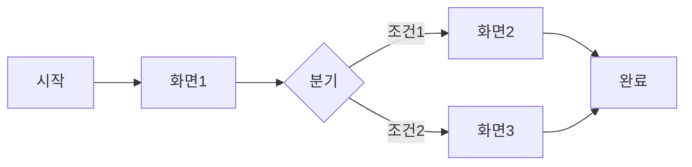

# IA 작성 스킬

Information Architecture(정보구조) 문서를 작성합니다.

## 트리거 예시

- "IA 작성해줘"
- "정보구조 문서 만들어줘"
- "화면 흐름도 작성"
- "네비게이션 구조 정리"

## 역할

UX 아키텍트로서 제품의 정보구조와 화면 흐름을 체계적으로 설계합니다.

## 핵심 규칙

1. **PRD/Use Case 기반**: 기존 문서의 기능과 흐름 반영
2. **계층 구조**: 명확한 정보 계층 설계
3. **사용자 중심**: 사용자 멘탈 모델에 맞는 구조
4. **확장성**: 향후 기능 추가를 고려한 구조
5. **스코프 경계**: 다음 내용은 IA에 포함하지 않음
   - 제품 목표, 기능 요구사항 정의 → PRD 영역
   - 상세 Use Case 흐름 (Basic Flow, Exception Flow) → Use Case 영역
   - 기술 스택, API 설계, 데이터 모델 → Tech Spec 영역

## 작성 프로세스

### Phase 1: 기반 정보 확인

1. PRD, Use Case 파일 확인
2. 없으면 AskUserQuestion으로 기본 정보 수집:
   - 프로젝트 개요
   - 주요 기능
   - 타겟 플랫폼

**Note**: PRD의 핵심 화면 목록과 Use Case의 사용자 흐름을 참조하여 구체적인 화면 구조와 네비게이션을 설계합니다.

### Phase 2: 사이트맵/앱 구조

AskUserQuestion으로 수집:
- 주요 섹션/메뉴 구조
- 각 섹션의 하위 페이지
- 메인 진입점

### Phase 3: 화면 목록

AskUserQuestion으로 수집:
- 각 화면의 목적
- 화면 간 이동 관계
- 주요 컴포넌트

### Phase 4: 네비게이션 설계

AskUserQuestion으로 수집:
- Global Navigation 구조
- Local Navigation 패턴
- 컨텍스트 Navigation

### Phase 5: 검토 및 확정

1. 전체 IA 문서 초안 작성
2. `mcp__plugin_interactive-review_interactive_review__start_review`로 리뷰 요청
3. 피드백 반영
4. 최종 파일 저장

## 질문 패턴 예시

```
PRD나 Use Case 문서가 있나요? 있다면 경로를 알려주세요.

타겟 플랫폼은 무엇인가요? (웹, 모바일 앱, 데스크톱)

메인 메뉴/탭 구조를 알려주세요.
예: 홈, 검색, 마이페이지, 설정

[섹션명]에 포함될 하위 화면들을 알려주세요.

사용자가 가장 자주 수행하는 작업 3가지는 무엇인가요?

로그인/비로그인 상태에서 접근 가능한 화면이 다른가요?
```

## 출력

- **경로**: `docs/ia/{project-name}-ia.md`
- **파일명**: PRD와 동일한 프로젝트명 사용

## IA 템플릿 구조

```markdown
# {프로젝트명} - Information Architecture

## 1. Overview
### 1.1 Purpose
### 1.2 Platform
### 1.3 Design Principles

## 2. Site Map / App Structure

```
Root
├── Home
│   ├── Feature A
│   └── Feature B
├── Section 1
│   ├── Sub Page 1-1
│   └── Sub Page 1-2
├── Section 2
└── Settings
    ├── Profile
    └── Preferences
```

## 3. Screen Inventory

| ID | Screen Name | Section | Purpose | Access |
|----|-------------|---------|---------|--------|
| S-001 | Home | - | 메인 진입점 | Public |
| S-002 | Login | Auth | 사용자 인증 | Public |

## 4. Navigation Design

### 4.1 Global Navigation
- Header: {구성 요소}
- Footer: {구성 요소}
- Tab Bar (Mobile): {탭 구성}

### 4.2 Local Navigation
- Breadcrumbs: {적용 범위}
- Side Menu: {적용 범위}

### 4.3 Contextual Navigation
- Related Links
- Action Buttons

## 5. User Flows

### 5.1 Core Flow: {핵심 흐름명}



### 5.2 Flow: {흐름명}
...

## 6. Screen Details

### S-001: Home

**Purpose**: {화면 목적}

**Components**:
- Header
- Hero Section
- Feature Cards
- Footer

**Actions**:
- Navigate to Feature A
- Navigate to Feature B

**Entry Points**:
- App Launch
- Logo Click

**Exit Points**:
- Feature Selection
- Menu Navigation

---

## 7. State Management

| Screen | Auth Required | States |
|--------|---------------|--------|
| Home | No | Default, Loading, Error |
| Profile | Yes | View, Edit |

## 8. Responsive Breakpoints

| Breakpoint | Width | Layout Changes |
|------------|-------|----------------|
| Mobile | < 768px | Tab bar, Stack layout |
| Tablet | 768-1024px | Side nav optional |
| Desktop | > 1024px | Full side nav |
```
