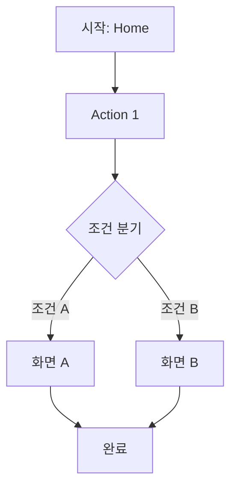
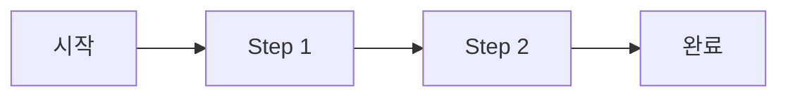

# {프로젝트명} - Information Architecture

---

## 1. Overview

### 1.1 Purpose

{이 문서의 목적 - 제품의 정보구조와 네비게이션 설계}

### 1.2 Platform

- **Primary**: {웹/iOS/Android/Desktop}
- **Secondary**: {있다면}

### 1.3 Design Principles

1. **{원칙 1}**: {설명}
2. **{원칙 2}**: {설명}
3. **{원칙 3}**: {설명}

---

## 2. Site Map / App Structure

```
{프로젝트명}
│
├── Home
│   ├── Hero Section
│   ├── Feature Highlights
│   └── Quick Actions
│
├── {Section 1}
│   ├── {Sub Page 1-1}
│   ├── {Sub Page 1-2}
│   └── {Sub Page 1-3}
│
├── {Section 2}
│   ├── {Sub Page 2-1}
│   └── {Sub Page 2-2}
│
├── {Section 3}
│   └── {Sub Page 3-1}
│
└── Settings
    ├── Profile
    ├── Preferences
    └── Help
```

---

## 3. Screen Inventory

| ID | Screen Name | Section | Purpose | Auth Required |
|----|-------------|---------|---------|---------------|
| S-001 | Home | - | 메인 진입점, 주요 기능 접근 | No |
| S-002 | Login | Auth | 사용자 인증 | No |
| S-003 | Register | Auth | 신규 가입 | No |
| S-004 | {화면명} | {섹션} | {목적} | {Yes/No} |
| S-005 | {화면명} | {섹션} | {목적} | {Yes/No} |

---

## 4. Navigation Design

### 4.1 Global Navigation

**Header (Desktop)**:
- Logo (Home 링크)
- Main Menu: {메뉴 항목들}
- User Menu: {프로필, 설정, 로그아웃}

**Tab Bar (Mobile)**:
| Position | Icon | Label | Target |
|----------|------|-------|--------|
| 1 | Home | 홈 | S-001 |
| 2 | {아이콘} | {라벨} | {화면} |
| 3 | {아이콘} | {라벨} | {화면} |
| 4 | {아이콘} | {라벨} | {화면} |
| 5 | Profile | 마이 | S-XXX |

### 4.2 Local Navigation

**Breadcrumbs**:
- 적용 범위: {깊이 2 이상인 페이지}
- 형식: Home > Section > Current Page

**Side Menu**:
- 적용 범위: {Settings 등 하위 메뉴가 많은 섹션}

### 4.3 Contextual Navigation

- **Related Links**: {관련 콘텐츠 링크}
- **Action Buttons**: {주요 CTA 버튼}
- **Back Navigation**: {뒤로가기 패턴}

---

## 5. User Flows

### 5.1 Core Flow: {핵심 흐름명}

**Goal**: {사용자 목표}



**Steps**:
1. 사용자가 Home에서 시작
2. {Action 1} 수행
3. 조건에 따라 분기
4. 완료

### 5.2 Flow: {흐름명}

**Goal**: {사용자 목표}



---

## 6. Screen Details

### S-001: Home

**Purpose**: 앱의 메인 진입점, 주요 기능으로의 빠른 접근 제공

**Layout**:
```
+---------------------------+
|         Header            |
+---------------------------+
|                           |
|       Hero Section        |
|                           |
+---------------------------+
|  Card 1  |  Card 2  |     |
+---------------------------+
|       Feature List        |
+---------------------------+
|         Footer            |
+---------------------------+
```

**Components**:
- Header: Logo, Navigation, User Menu
- Hero Section: {설명}
- Feature Cards: {설명}
- Footer: {설명}

**Actions**:
- Navigate to {Feature 1}
- Navigate to {Feature 2}
- {기타 액션}

**Entry Points**:
- App Launch
- Logo Click from any page

**Exit Points**:
- Feature Selection
- Menu Navigation
- User Menu Actions

---

### S-002: {화면명}

**Purpose**: {목적}

**Components**:
- {컴포넌트 목록}

**Actions**:
- {액션 목록}

---

## 7. State Management

| Screen | Auth Required | Loading | Empty | Error | Success |
|--------|---------------|---------|-------|-------|---------|
| Home | No | Yes | No | Yes | - |
| {화면} | {Yes/No} | {Yes/No} | {Yes/No} | {Yes/No} | {Yes/No} |

### State Descriptions

- **Loading**: 데이터 로딩 중 표시
- **Empty**: 데이터가 없을 때 표시
- **Error**: 오류 발생 시 표시
- **Success**: 작업 성공 시 표시

---

## 8. Responsive Breakpoints

| Breakpoint | Width | Layout Changes |
|------------|-------|----------------|
| Mobile | < 768px | Single column, Tab bar, Stack layout |
| Tablet | 768-1024px | Two columns, Optional side nav |
| Desktop | > 1024px | Multi-column, Full side nav, Expanded header |

### Mobile-specific Patterns

- Bottom Sheet for modals
- Pull to refresh
- Swipe gestures

### Desktop-specific Patterns

- Hover states
- Keyboard shortcuts
- Multi-panel views

---

## Document Info

| Item | Value |
|------|-------|
| Version | 1.0 |
| Created | {YYYY-MM-DD} |
| Last Updated | {YYYY-MM-DD} |
| Author | {작성자} |
| Related PRD | {PRD 파일 경로} |
| Related Use Case | {Use Case 파일 경로} |
