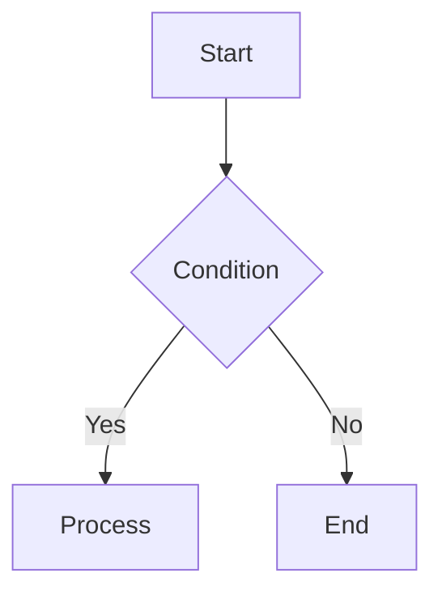
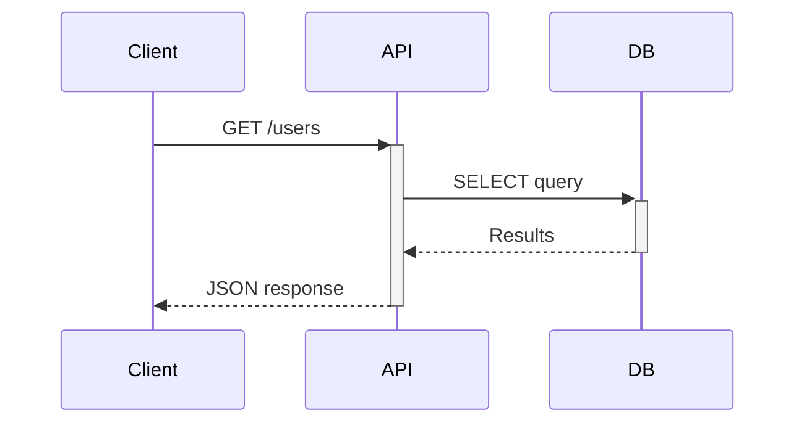
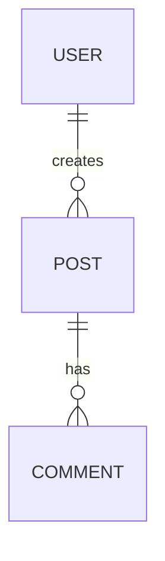

# Slidev Presentation Creator

Generate Slidev markdown-based presentations through an interview workflow.

## Trigger Examples

<example>
Context: User wants to create a presentation
user: "PT 만들어줘"
assistant: Loads create-slide skill, starts interview to gather presentation requirements.
<commentary>
Presentation creation request without details - start interview.
</commentary>
</example>

<example>
Context: User has specific topic
user: "React Server Components에 대해 발표 자료 만들어줘"
assistant: Loads create-slide skill, starts interview with topic pre-filled.
<commentary>
Topic given but other details needed - interview with context.
</commentary>
</example>

<example>
Context: User wants slides in existing Slidev project
user: "새 슬라이드 추가해줘"
assistant: Loads create-slide skill, detects existing project, skips setup.
<commentary>
Existing project detected - skip setup, go straight to content creation.
</commentary>
</example>

## Critical Rules

1. **Interview first** - Always gather information through interview before generating slides
2. **Use AskUserQuestion** - All questions must use the AskUserQuestion tool
3. **Auto-detect** - Automatically detect Slidev project existence and branch between setup/create
4. **Anti-AI writing** - Natural text that doesn't sound AI-generated
5. **User's language** - Use the user's preferred language for content, keep technical terms unchanged
6. **Leverage mcpdocs/deepwiki** - Look up documentation in real-time when Slidev syntax is uncertain

## Auto-Detect Logic

When the skill runs, check in this order:

```
1. Does package.json have slidev dependencies?
2. Does slides.md or any *.md Slidev file exist?
3. If neither exists → Execute Setup Phase
4. If exists → Go straight to Interview Phase
```

---

## Phase 0: Setup (Only when Slidev project doesn't exist)

### Execution Condition
- When `@slidev/cli` is not in `package.json` or `package.json` doesn't exist

### Procedure

1. Initialize Slidev project:
```bash
npm init slidev@latest
```

2. Theme auto-installation: Slidev detects the theme from frontmatter and prompts to install it on first run. No manual `npm install` needed for themes.

3. Verify basic directory structure:
```
project/
  package.json
  slides.md
  components/     # Custom Vue components
  public/         # Images, assets
  pages/          # Split slides (optional)
```

4. After setup completes, proceed to Interview Phase

---

## Phase 1: Interview (Information Gathering)

Conduct the interview step by step. Use AskUserQuestion at each stage.

### Step 1: Basic Information

Items to collect:
- **Presentation topic**: What is the presentation about?
- **Audience**: Who is the audience? (developers, non-developers, mixed)
- **Duration**: How many minutes? (used to determine slide count)
- **Filename**: Output file name (default: slides.md)

Slide count guide by duration:
| Duration | Slide Count | Notes |
|----------|-------------|-------|
| 5 min | 5-8 slides | Lightning talk |
| 10 min | 8-12 slides | Short talk |
| 20 min | 15-20 slides | Standard |
| 30 min | 20-30 slides | Conference talk |
| 45+ min | 30-40 slides | Keynote |

### Step 2: Structure and Content

Items to collect:
- **Core message**: The one thing the audience should remember
- **Section structure**: Main sections to cover
- **Code examples**: Need to show code? Which language/framework?
- **Diagrams**: Need visuals like architecture, flowcharts, ERDs?
- **Demos**: Need live coding or interactive elements?

### Step 3: Style and Tone

Items to collect:
- **Theme selection**: Present theme options
- **Tone**: Formal / Friendly / Educational / Technical
- **Special requirements**: Company logo, specific colors, fonts, etc.

Theme options (present via AskUserQuestion):
| Theme | Style | Best For |
|-------|-------|----------|
| `apple-basic` (default) | Apple Keynote style, clean and minimal | General purpose, tech talks |
| `seriph` | Serif fonts, classic feel | Academic, formal presentations |
| `geist` | Vercel/Geist design system, clean and modern | Frontend, web technologies |
| `purplin` | Purple gradient, vibrant feel | Product launches, demos |
| `academic` | Academic paper style | Research presentations, paper introductions |
| `bricks` | Block-based, structural | Architecture, system design |

---

## Phase 2: Slide Generation

### Basic Flow Structure

Apply this standard flow based on interview results:

```
Cover (intro layout)
  → Agenda/Table of Contents (default/toc layout)
  → Section 1 Title (section layout)
    → Section 1 Content Slides
  → Section 2 Title (section layout)
    → Section 2 Content Slides
  → ...
  → Summary (default layout)
  → Q&A (end layout)
```

### Headmatter Template

```yaml
---
theme: apple-basic
title: "{Presentation Title}"
info: |
  {Brief description}
author: "{Presenter}"
keywords: "{Keywords}"
layout: intro
---
```

### Layout Selection Guide

Choose appropriate layouts based on content type:

| Content Type | Layout | Notes |
|-------------|--------|-------|
| First slide (title) | `intro` / `intro-image` | apple-basic exclusive |
| Image + text | `image-right` / `image-left` / `intro-image-right` | Includes apple-basic exclusive |
| Section divider | `section` | Start section with large text |
| General content | `default` | Basic text + lists |
| Bullets only | `bullets` | apple-basic exclusive |
| Code-focused | `default` | Code block heavy |
| Comparison/2-column | `two-cols` / `two-cols-header` | Left-right split |
| Quote | `quote` | Emphasize specific sentences |
| Numbers/stats | `fact` | Large number + description |
| Emphasis statement | `statement` | Highlight core message |
| Full-screen image | `image` | Background image |
| 3 images | `3-images` | apple-basic exclusive |
| Web page embed | `iframe` / `iframe-left` / `iframe-right` | URL embedding |
| Final slide | `end` | Thanks, Q&A |

### Slide Writing Rules

Follow these principles when writing each slide:

1. **One idea per slide** - Don't mix multiple topics on a single slide
2. **Minimize text** - 3-5 bullet points, one line per item
3. **Use v-click** - Show content sequentially to maintain audience focus
4. **Code essentials only** - Highlight key parts, not entire code
5. **Leverage diagrams** - Visualize with Mermaid instead of text explanations
6. **Include presenter notes** - Write presenter notes for each slide

### Code Block Writing

```markdown
# Basic code block (line highlighting)
```ts {2|4-6|all}
function greet(name: string) {
  console.log(`Hello, ${name}`)  // Click 1: highlight this line

  return {                        // Click 2: highlight this block
    message: `Hello, ${name}`,
    timestamp: Date.now()
  }
}
```

# Shiki Magic Move (code change animation)
````md
```ts {*|*|*}{lines:true}
// Show step-by-step code changes with animation
```
````

# Monaco Editor (live coding)
```ts {monaco}
// Editable code editor during presentation
console.log('edit me')
```
```

### Mermaid Diagrams

```markdown
# Flowchart


# Sequence diagram


# ERD

```

### Animations & Transitions

```markdown
# v-click: sequential reveal
<v-click>

- First point

</v-click>

<v-click>

- Second point

</v-click>

# v-clicks: auto sequential reveal of children
<v-clicks>

- Item 1
- Item 2
- Item 3

</v-clicks>

# Slide transition effects (frontmatter)
---
transition: slide-left
---

# Available transitions: fade, slide-left, slide-right, slide-up, slide-down
```

---

## Anti-AI Writing Rules (Mandatory)

Apply these rules to all generated text.
Based on Wikipedia's "Signs of AI writing" guidelines.

### Absolutely Forbidden Expressions

| Category | Forbidden |
|---------|----------|
| Exaggeration | "innovative", "groundbreaking", "powerful", "plays a key role" |
| AI vocabulary | "delve", "crucial", "landscape", "tapestry", "vibrant", "foster", "showcase", "underscore" |
| Promotional | "amazing", "outstanding", "perfect", "seamless", "revolutionary" |
| Empty phrases | "needless to say", "goes without saying", "noteworthy" |
| Patterns | Rule of three overuse, em dash (---) overuse, bold header lists |
| Conclusions | "bright future", "exciting era", "unlimited possibilities" |

### Write Like This Instead

- **Be specific**: Instead of "good performance", say "response time dropped from 200ms to 50ms"
- **Be direct**: Instead of "one could say that", say "is"
- **Be brief**: One line per bullet. If explanation needed, put it in presenter notes
- **Use real data**: Numbers, benchmarks, examples instead of vague claims
- **Be natural**: Tone that the presenter would actually use

### Natural Presenter Notes Too

```markdown
<!--
Pause here and check audience reaction.
Start with "Why this matters is..."
If demo fails, skip to the screenshot slide.
-->
```

Don't use "Certainly!", "Let me explain", "This is crucial" in notes.
Only write natural guidance you'd actually use during a presentation.

---

## Phase 3: Review & Output

### Post-Generation Steps

1. **Save file**: Save with filename specified in interview
2. **Structure summary**: Show generated slide structure in table format
3. **Execution guide**: Provide `npx slidev {filename}` command
4. **Edit suggestions**: Check if any additions/modifications needed

### Output Example

```
slides.md generated (18 slides)

| # | Layout | Title |
|---|---------|------|
| 1 | intro | React Server Components |
| 2 | default | Agenda |
| 3 | section | What are Server Components? |
| ...

Run: npx slidev slides.md
Edit: npx slidev slides.md --open (with editor)
PDF: npx slidev export slides.md
```

---

## mcpdocs/deepwiki Usage Guide

Look up documentation in real-time when Slidev syntax or features are uncertain.

### Using mcpdocs

```
# Check Slidev doc sources
mcp__mcpdocs__list_doc_sources → Check "slidev" entry

# Look up specific syntax
mcp__mcpdocs__fetch_docs(url="https://sli.dev/guide/syntax.md")
mcp__mcpdocs__fetch_docs(url="https://sli.dev/builtin/layouts.md")
mcp__mcpdocs__fetch_docs(url="https://sli.dev/builtin/components.md")
```

### Using deepwiki

```
# Questions about Slidev architecture or advanced features
mcp__deepwiki__ask_question(
  repoName="slidevjs/slidev",
  question="How does v-click animation work with nested elements?"
)
```

### When to Look Up
- When checking theme-specific layouts
- When using new Slidev features
- When user requests a specific feature but you're uncertain
- When errors occur or syntax doesn't work

---

## Example: Complete slides.md Structure

```markdown
---
theme: apple-basic
title: React Server Components 실전 가이드
info: |
  React 18의 Server Components를 실제 프로젝트에 적용하는 방법
author: ""
layout: intro
---

# React Server Components 실전 가이드

RSC가 바꾸는 React 개발 방식

<div class="absolute bottom-10">
  <span class="font-700">
    2026.02 / 사내 기술 공유
  </span>
</div>

<!--
인사하고 바로 시작합니다.
"오늘은 RSC를 실제로 써보면서 배운 것들을 공유하려고 합니다."
-->

---
layout: default
---

# 목차

<Toc />

<!--
목차는 빠르게 훑고 넘어갑니다. 30초.
-->

---
layout: section
---

# Server Components란?

<!--
"먼저 Server Components가 뭔지부터 짚고 가겠습니다."
-->

---

# Client vs Server Component

<v-clicks>

- Server Component: 서버에서 렌더링, 번들에 포함되지 않음
- Client Component: `"use client"` 선언, 브라우저에서 실행
- 기본값이 Server Component (React 18+)

</v-clicks>

<!--
각 항목을 클릭하면서 하나씩 설명합니다.
"가장 큰 차이는 번들 사이즈입니다. SC는 서버에서만 실행되니까 클라이언트 번들에 안 들어갑니다."
-->

---
layout: two-cols
---

# 코드 비교

```tsx
// Server Component (기본)
async function UserList() {
  const users = await db.user.findMany()
  return (
    <ul>
      {users.map(u => <li>{u.name}</li>)}
    </ul>
  )
}
```

::right::

```tsx
// Client Component
"use client"
function Counter() {
  const [count, setCount] = useState(0)
  return (
    <button onClick={() => setCount(c => c + 1)}>
      {count}
    </button>
  )
}
```

<!--
"왼쪽은 SC입니다. DB를 직접 쿼리하고 있죠. 오른쪽은 CC. useState 같은 훅이 필요하면 use client를 붙입니다."
-->

---
layout: fact
---

# 40%
번들 사이즈 감소 (실제 프로젝트 적용 결과)

<!--
"저희 프로젝트에서 SC 전환 후 측정한 수치입니다."
구체적인 before/after 수치를 준비해두세요.
-->

---
layout: end
---

# 감사합니다

질문 있으시면 편하게 해주세요.
```

---

## Notes

- This skill is based on the official Slidev documentation (https://sli.dev)
- Theme-specific layouts can be found in references/themes.md
- When Slidev syntax is updated, look up the latest documentation via mcpdocs
- Also see the official Slidev skill: `npx skills add slidevjs/slidev`
