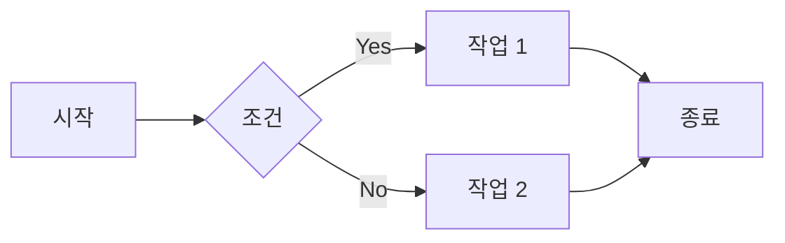
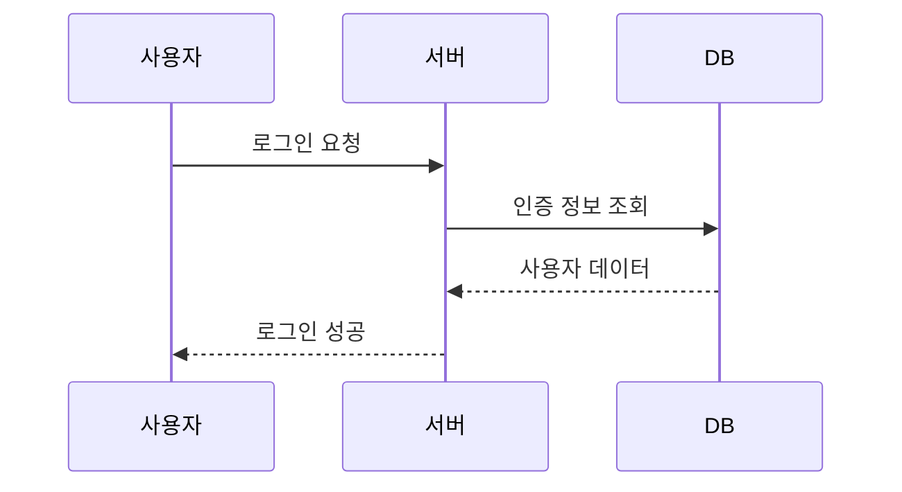
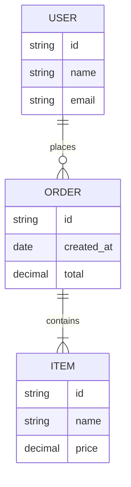
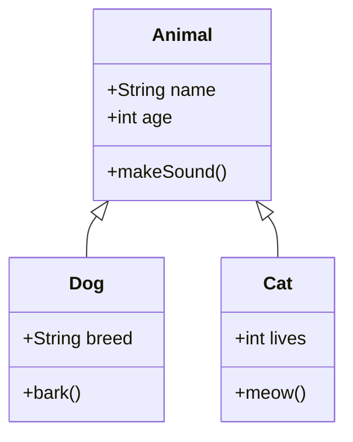
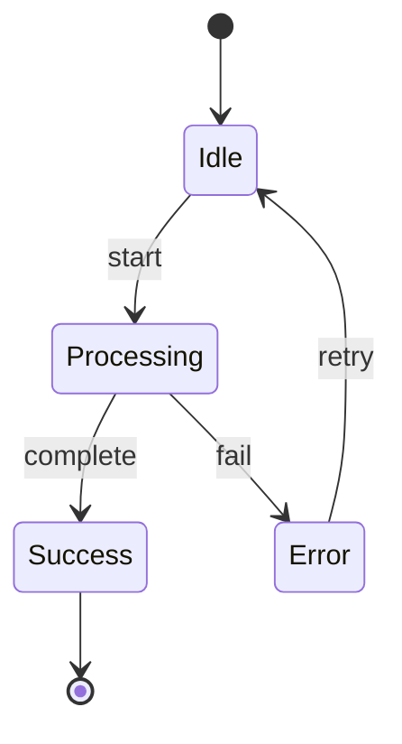
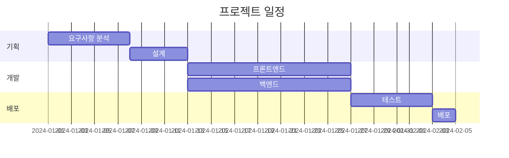
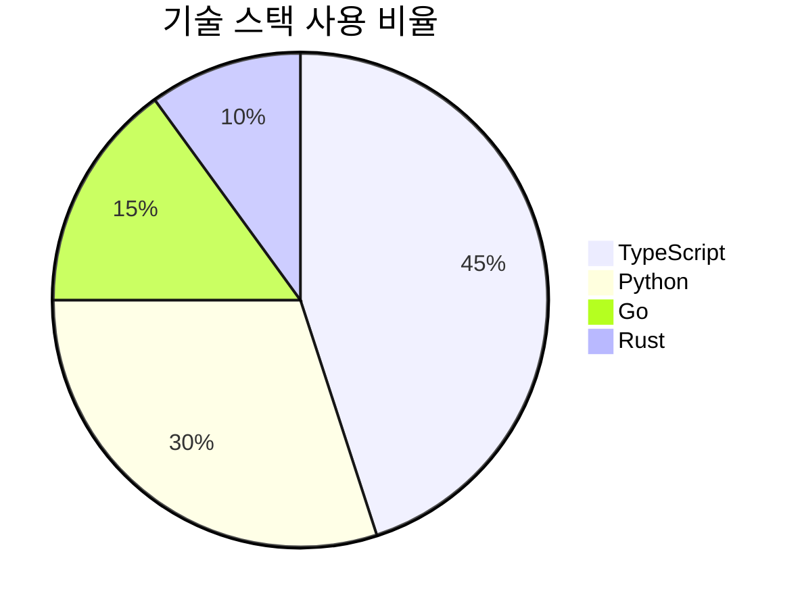
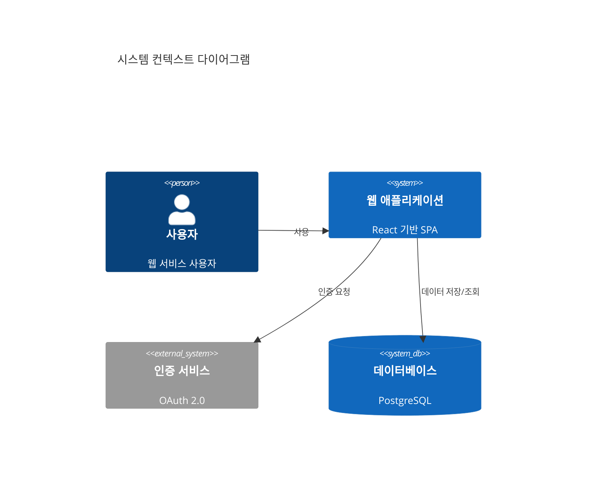
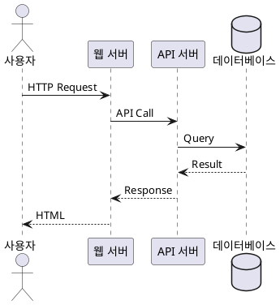
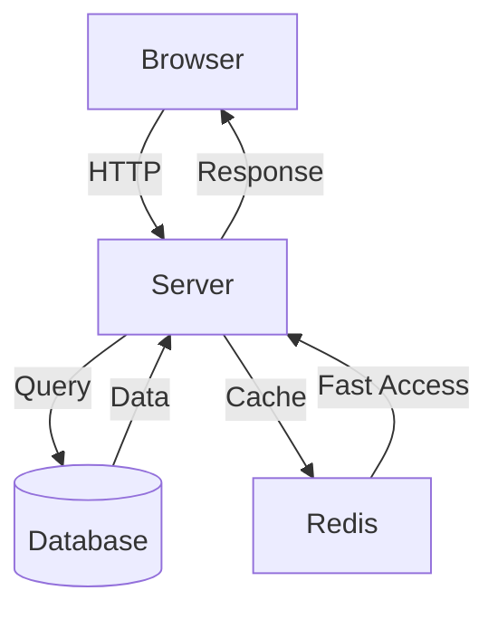

# Slidev 문법 참조 가이드

Slidev 프레젠테이션 생성을 위한 완전한 문법 레퍼런스입니다.

## 1. 슬라이드 구분자

슬라이드는 `---`로 구분됩니다.

```markdown
# 첫 번째 슬라이드

내용

---

# 두 번째 슬라이드

내용

---

# 세 번째 슬라이드

내용
```

## 2. Frontmatter & Headmatter

### Headmatter (첫 번째 슬라이드)

전체 프레젠테이션 설정은 첫 슬라이드 상단의 YAML frontmatter에 작성합니다.

```yaml
---
theme: default
title: 프레젠테이션 제목
info: |
  ## 프레젠테이션 설명
  상세 정보를 여러 줄로 작성 가능
author: 작성자 이름
keywords: slidev, presentation, markdown
layout: cover
transition: slide-left
mdc: true
fonts:
  sans: Noto Sans KR
  serif: Noto Serif KR
  mono: Fira Code
---

# 제목 슬라이드
```

**주요 headmatter 속성:**

| 속성 | 설명 | 예시 |
|------|------|------|
| `theme` | 테마 이름 | `default`, `seriph`, `apple-basic` |
| `title` | 프레젠테이션 제목 | `"My Presentation"` |
| `info` | 설명 (다중 라인 가능) | `"## Description\nDetails"` |
| `author` | 작성자 | `"John Doe"` |
| `keywords` | 키워드 (쉼표 구분) | `slidev, presentation` |
| `layout` | 첫 슬라이드 레이아웃 | `cover`, `intro`, `default` |
| `transition` | 기본 전환 효과 | `slide-left`, `fade`, `zoom` |
| `mdc` | MDC 문법 활성화 | `true`, `false` |
| `fonts` | 폰트 설정 | 아래 참조 |

### Per-slide Frontmatter

각 슬라이드는 개별 frontmatter를 가질 수 있습니다.

```yaml
---
layout: two-cols
background: /images/background.jpg
class: text-center
transition: fade-out
clicks: 3
---

# 슬라이드 내용

::right::

# 오른쪽 내용
```

**주요 per-slide frontmatter 속성:**

| 속성 | 설명 | 예시 |
|------|------|------|
| `layout` | 슬라이드 레이아웃 | `default`, `two-cols`, `center`, `cover`, `section`, `quote`, `image-right` |
| `background` | 배경 이미지/색상 | `/path/to/image.jpg`, `#1e1e1e`, `https://example.com/bg.png` |
| `class` | CSS 클래스 | `text-center`, `dark` |
| `transition` | 전환 효과 | `slide-left`, `slide-up`, `fade`, `zoom` |
| `clicks` | 클릭 단계 수 | `3` |
| `disabled` | 슬라이드 비활성화 | `true` |
| `hide` | 슬라이드 숨김 | `true` |
| `routeAlias` | URL 경로 별칭 | `/custom-path` |
| `src` | 외부 파일 import | `./slides/intro.md` |
| `zoom` | 확대/축소 비율 | `0.8`, `1.2` |

## 3. Presenter Notes

슬라이드 하단에 HTML 주석으로 발표자 노트를 작성합니다.

```markdown
# 슬라이드 제목

슬라이드 내용

<!--
발표자 노트:
- 강조할 포인트 1
- 강조할 포인트 2
- 예상 소요 시간: 2분
-->
```

발표자 모드(`Presenter View`)에서만 표시됩니다.

## 4. Code Blocks

### 기본 문법

````markdown
```typescript
function greet(name: string): string {
  return `Hello, ${name}!`;
}
```
````

### 줄 강조

````markdown
```typescript {2|4-6|all}
function calculate(a: number, b: number) {
  const sum = a + b;  // 첫 클릭에 강조

  if (sum > 100) {    // 두 번째 클릭에 4-6줄 강조
    return sum * 2;
  }

  return sum;         // 세 번째 클릭에 전체 강조
}
```
````

**강조 문법:**
- `{2}` - 2번 줄
- `{2,5}` - 2번, 5번 줄
- `{2-5}` - 2번부터 5번까지
- `{2|4-6|all}` - 클릭 단계별 강조
- `{2-5,8,10-12}` - 복합 지정

### 줄 번호

````markdown
```python {lines:true}
def fibonacci(n):
    if n <= 1:
        return n
    return fibonacci(n-1) + fibonacci(n-2)
```
````

### 최대 높이

````markdown
```javascript {maxHeight:'200px'}
// 긴 코드가 200px을 넘으면 스크롤
const data = [1, 2, 3, 4, 5, 6, 7, 8, 9, 10];
// ... 많은 줄
```
````

### 파일명 표시

````markdown
```typescript {file:'src/utils.ts'}
export function formatDate(date: Date): string {
  return date.toISOString().split('T')[0];
}
```
````

### 복합 사용

````markdown
```go {lines:true,maxHeight:'300px',file:'main.go'} {2,5-7|all}
package main

import "fmt"

func main() {
    fmt.Println("Hello, World!")
}
```
````

## 5. Shiki Magic Move

코드 변경을 애니메이션으로 표현합니다.

````markdown
````md magic-move
```typescript
// Step 1: 기본 함수
function greet(name: string) {
  console.log("Hello " + name);
}
```

```typescript
// Step 2: 반환 값 추가
function greet(name: string): string {
  return "Hello " + name;
}
```

```typescript
// Step 3: Template literal 사용
function greet(name: string): string {
  return `Hello, ${name}!`;
}
```
````
````

**특징:**
- 각 코드 블록 사이의 변경사항을 자동으로 애니메이션
- 클릭할 때마다 다음 단계로 전환
- 추가/삭제/수정된 라인을 시각적으로 표시

## 6. Monaco Editor

### 기본 편집기

````markdown
```typescript {monaco}
function fibonacci(n: number): number {
  if (n <= 1) return n;
  return fibonacci(n - 1) + fibonacci(n - 2);
}

console.log(fibonacci(10));
```
````

### 실행 가능한 편집기

````markdown
```typescript {monaco-run}
console.log('실시간 실행 결과를 볼 수 있습니다');
const result = [1, 2, 3].map(x => x * 2);
console.log(result);
```
````

### Diff 모드

````markdown
```typescript {monaco-diff}
// Before
function oldFunction(x) {
  return x + 1;
}
~~~
// After
function newFunction(x: number): number {
  return x + 1;
}
```
````

**Monaco 옵션:**
- `{monaco}` - 편집 가능한 코드 에디터
- `{monaco-run}` - 실행 가능 (JavaScript/TypeScript)
- `{monaco-diff}` - 변경사항 비교 (`~~~`로 구분)

## 7. LaTeX

### Inline 수식

```markdown
피타고라스 정리: $a^2 + b^2 = c^2$

원의 넓이: $A = \pi r^2$
```

### Block 수식

```markdown
$$
\frac{-b \pm \sqrt{b^2 - 4ac}}{2a}
$$

$$
\begin{aligned}
  \nabla \times \vec{\mathbf{B}} -\, \frac1c\, \frac{\partial\vec{\mathbf{E}}}{\partial t} &= \frac{4\pi}{c}\vec{\mathbf{j}} \\
  \nabla \cdot \vec{\mathbf{E}} &= 4 \pi \rho \\
  \nabla \times \vec{\mathbf{E}}\, +\, \frac1c\, \frac{\partial\vec{\mathbf{B}}}{\partial t} &= \vec{\mathbf{0}} \\
  \nabla \cdot \vec{\mathbf{B}} &= 0
\end{aligned}
$$
```

**LaTeX 예시:**

| 표현 | 코드 |
|------|------|
| 분수 | `\frac{a}{b}` |
| 제곱근 | `\sqrt{x}` |
| 시그마 | `\sum_{i=1}^{n} x_i` |
| 적분 | `\int_{a}^{b} f(x) dx` |
| 극한 | `\lim_{x \to \infty} f(x)` |
| 행렬 | `\begin{pmatrix} a & b \\ c & d \end{pmatrix}` |

## 8. Mermaid Diagrams

### Flowchart

````markdown

````

### Sequence Diagram

````markdown

````

### Entity Relationship Diagram

````markdown

````

### Class Diagram

````markdown

````

### State Diagram

````markdown

````

### Gantt Chart

````markdown

````

### Pie Chart

````markdown

````

### C4 Diagram

````markdown

````

## 9. PlantUML

````markdown

````

**PlantUML 주요 타입:**
- `@startuml` / `@enduml` - 시작/종료
- Sequence, Use Case, Class, Activity, Component, State, Object 다이어그램 지원

## 10. MDC Syntax

MDC(Markdown Components)를 사용하려면 headmatter에 `mdc: true` 설정이 필요합니다.

### Inline 스타일

```markdown
---
mdc: true
---

# MDC 예시

[빨간색 텍스트]{style="color:red"}

[큰 텍스트]{style="font-size:2em; font-weight:bold"}

[배경색]{style="background-color:yellow; padding:4px"}
```

### Block 컴포넌트

```markdown
::div{class="bg-blue-500 text-white p-4"}
파란색 배경의 박스
::

::alert{type="warning"}
경고 메시지입니다
::

::card{title="제목"}
카드 내용
::
```

### Props 전달

```markdown
::component{prop1="value1" prop2="value2" class="custom-class"}
컴포넌트 내용
::
```

## 11. Scoped CSS

각 슬라이드에 `<style>` 블록을 추가하여 해당 슬라이드에만 적용되는 스타일을 정의할 수 있습니다.

```markdown
# 스타일이 적용된 슬라이드

<div class="custom-box">
  맞춤 스타일 박스
</div>

<style>
.custom-box {
  background: linear-gradient(135deg, #667eea 0%, #764ba2 100%);
  color: white;
  padding: 2rem;
  border-radius: 12px;
  box-shadow: 0 4px 6px rgba(0,0,0,0.1);
}

h1 {
  color: #667eea;
  text-shadow: 2px 2px 4px rgba(0,0,0,0.1);
}
</style>
```

**특징:**
- 슬라이드별로 독립적인 스타일 적용
- Scoped 스타일이므로 다른 슬라이드에 영향 없음
- CSS, Sass, Less 모두 사용 가능

## 12. Importing Slides

### src frontmatter

```yaml
---
src: ./slides/intro.md
---
```

### 파일 구조 예시

```
slides.md           (메인 파일)
slides/
  ├── intro.md      (소개 슬라이드들)
  ├── features.md   (기능 슬라이드들)
  └── conclusion.md (결론 슬라이드들)
```

**slides.md:**

```markdown
---
theme: default
title: My Presentation
---

# 커버 슬라이드

---
src: ./slides/intro.md
---

---
src: ./slides/features.md
---

---
src: ./slides/conclusion.md
---
```

**slides/intro.md:**

```markdown
# 소개

내용

---

# 배경

배경 설명
```

## 13. Slot Sugar

레이아웃의 슬롯을 간편하게 사용하는 문법입니다.

### two-cols 레이아웃

```markdown
---
layout: two-cols
---

# 왼쪽 내용

왼쪽 컬럼

::right::

# 오른쪽 내용

오른쪽 컬럼
```

### image-right 레이아웃

```markdown
---
layout: image-right
image: /images/photo.jpg
---

# 텍스트 영역

왼쪽에 텍스트

오른쪽에 이미지
```

### 커스텀 슬롯

```markdown
---
layout: custom-layout
---

# 기본 슬롯

::header::

# 헤더 슬롯

::footer::

# 푸터 슬롯

::bottom::

# 하단 슬롯
```

**주요 슬롯:**
- `::right::` - 오른쪽 영역
- `::left::` - 왼쪽 영역 (명시적 사용)
- `::bottom::` - 하단 영역
- `::header::` - 헤더 영역
- `::footer::` - 푸터 영역

## 14. Icons

Iconify를 통해 다양한 아이콘 라이브러리를 사용할 수 있습니다.

### 기본 사용법

```markdown
# 아이콘 예시

<mdi-account /> 계정
<mdi-home /> 홈
<carbon-email /> 이메일
<bi-github /> GitHub
<logos-vue /> Vue.js
```

### 스타일 적용

```markdown
<mdi-check class="text-green-500 text-2xl" />
<mdi-close style="color: red; font-size: 24px;" />
```

### 인라인 사용

```markdown
Vue <logos-vue class="inline" /> React <logos-react class="inline" />
```

**주요 아이콘 세트:**

| Prefix | 라이브러리 | 예시 |
|--------|-----------|------|
| `mdi-` | Material Design Icons | `<mdi-check />` |
| `carbon-` | Carbon Icons | `<carbon-email />` |
| `bi-` | Bootstrap Icons | `<bi-github />` |
| `logos-` | Brand Logos | `<logos-vue />` |
| `heroicons-` | Heroicons | `<heroicons-home />` |
| `fa-` | Font Awesome | `<fa-user />` |

**아이콘 검색:** [https://icones.js.org/](https://icones.js.org/)

## 15. Images

### public/ 폴더 이미지

```markdown
# 로컬 이미지


```

**파일 구조:**

```
public/
  └── images/
      ├── diagram.png
      └── photo.jpg
slides.md
```

### 원격 이미지

```markdown


```

### 배경 이미지

```yaml
---
background: /images/background.jpg
---

# 배경 이미지가 있는 슬라이드
```

**배경 옵션:**

```yaml
---
background: /images/bg.jpg
backgroundSize: cover
backgroundPosition: center
---
```

### 이미지 레이아웃

```markdown
---
layout: image
image: /images/large.jpg
---
```

```markdown
---
layout: image-right
image: /images/side.jpg
---

# 텍스트

왼쪽에 텍스트, 오른쪽에 이미지
```

### 이미지와 텍스트 조합

```markdown
<div class="grid grid-cols-2 gap-4">
  <div>
    
  </div>
  <div>
    
  </div>
</div>
```

---

## 실전 예시

### 완전한 슬라이드 예시

````markdown
---
theme: default
title: TypeScript 소개
info: |
  ## TypeScript 기초
  타입 시스템과 모던 JavaScript
author: John Doe
keywords: typescript, javascript, types
layout: cover
transition: slide-left
mdc: true
---

# TypeScript 소개

정적 타입을 가진 JavaScript 슈퍼셋

<div class="abs-br m-6">
  <logos-typescript-icon class="text-4xl" />
</div>

<!--
발표 시작 인사
예상 시간: 1분
-->

---
layout: two-cols
---

# 왜 TypeScript인가?

- <mdi-check class="text-green-500" /> 타입 안정성
- <mdi-check class="text-green-500" /> 개발 생산성 향상
- <mdi-check class="text-green-500" /> 에디터 지원

::right::

# JavaScript의 문제

- <mdi-close class="text-red-500" /> 런타임 에러
- <mdi-close class="text-red-500" /> 타입 불확실성
- <mdi-close class="text-red-500" /> 리팩토링 어려움

---
transition: fade-out
---

# 기본 타입

```typescript {1|3|5-7|all}
let name: string = "John";

let age: number = 30;

let isStudent: boolean = false;
let hobbies: string[] = ["reading", "coding"];
let point: [number, number] = [10, 20];
```

---

# 코드 진화 과정

````md magic-move
```javascript
// JavaScript
function add(a, b) {
  return a + b;
}
```

```typescript
// TypeScript - 타입 추가
function add(a: number, b: number) {
  return a + b;
}
```

```typescript
// TypeScript - 반환 타입 명시
function add(a: number, b: number): number {
  return a + b;
}
```
````

---
layout: center
---

# 수학 공식

이차방정식의 해: $x = \frac{-b \pm \sqrt{b^2 - 4ac}}{2a}$

$$
\sum_{i=1}^{n} i = \frac{n(n+1)}{2}
$$

---

# 아키텍처



---
background: /images/code-bg.jpg
class: text-center
---

# 감사합니다

Questions?

<style>
h1 {
  color: white;
  text-shadow: 2px 2px 8px rgba(0,0,0,0.8);
}
</style>
````
````

---

## 참고사항

1. **파일 인코딩:** UTF-8 사용 필수
2. **이미지 경로:** `public/` 폴더 기준 절대 경로 (`/images/file.png`)
3. **코드 블록:** 백틱 3개 또는 4개 사용
4. **YAML 들여쓰기:** 2 스페이스 권장
5. **Mermaid:** 복잡한 다이어그램은 렌더링 성능 고려
6. **LaTeX:** 복잡한 수식은 블록 형식 권장
7. **MDC:** 테마/레이아웃에 따라 지원 여부 다름

## 추가 리소스

- [Slidev 공식 문서](https://sli.dev/)
- [Iconify 아이콘 검색](https://icones.js.org/)
- [Mermaid 문서](https://mermaid.js.org/)
- [KaTeX 지원 함수](https://katex.org/docs/supported.html)
- [Shiki 언어 목록](https://github.com/shikijs/shiki/blob/main/docs/languages.md)
